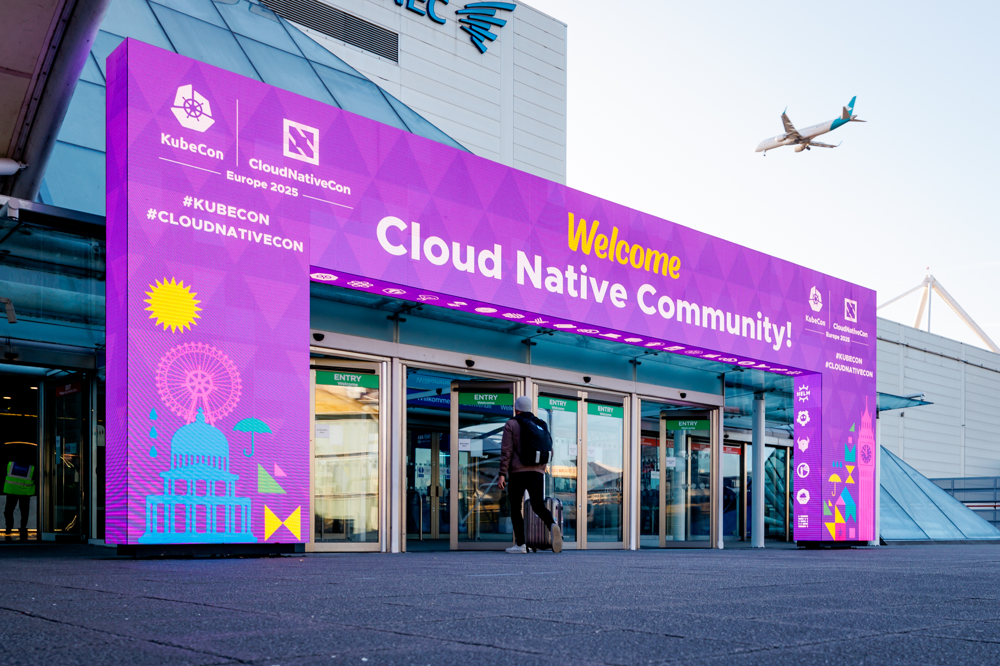

I was lucky enough to be able to attend KubeCon EU 2025, which was held at the ExCeL London from April 1st to April 4th. This year was my fourth in-person KubeCon event having attended Valencia, Amsterdam and Paris in previous years. Overall I really enjoyed this KubeCon edition, I thought it was an improvement over the last couple of years even though I don't think that the ExCeL is a great venue for KubeCon.

I attended the co-located events day on April 1st and the main conference days on April 2nd, 3rd & 4th. Overall I thought that the content reversed the trend seen in recent years towards being more end-user focused and less technical; however I found the co-located events day unbalanced and heavily vendor/sponsor focused. I would recommend anyone working in the cloud native space to attend KubeCon if they have the opportunity, it is a great way to learn about the latest developments in the ecosystem and to meet other people working in the space.

As with each KubeCon I've attended I feel that as well as leaving with a long list of things to follow up on, I left with a feeling of what the community is both focused on and excited about. While I'm sure that this is biased by my own interests and focus during the conference I think that these themes are worth sharing.

In my opinion the main theme running through the conference was that batch workloads are now driving a lot of the Kubernetes and cloud native agenda. This is an interesting development given that Kubernetes, while based on Borg which was focused on running batch jobs, was initially focused on serving stateless workloads. I remember seeing [Kueue](https://kueue.sigs.k8s.io/) for the first time at Valencia and it made me realize what Kubernetes needed to do to be able to run batch workloads at scale. In my opinion during the past couple of year a lot of the batch workload discussions have been tainted by the AI hype. While I still think that there is AI hype, the focus has returned to all of the technical work taking place to make Kubernetes a robust platform for running batch workloads. I'm looking forward to digging in to what is happening in this space, particularly focusing on _Kueue_, [JobSet](https://jobset.sigs.k8s.io/docs/overview/), & [kjob](https://github.com/kubernetes-sigs/kjob).

The other significant theme I observed was that multi-cluster has shifted from being something aspirational, to something that is now seen as a significant value add. I've been interested in this space for a while as we operate Kubernetes clusters in multiple clouds and regions, but I've always felt that the solutions were too complex and too immature. Despite this I've been considering if we could build a platform to provision Kubernetes clusters, I've looked at various technologies including [KCP](https://www.kcp.io/) and [Sveltos](https://projectsveltos.github.io/sveltos/). Other than the usual lack of resource, the main sticking point for multi-cluster has been the lack of workload support. Based on my experience at KubeCon I think that the community is serious about solving this problem. I'm interested in what Google has done with the [Multi-Cluster Orchestrator](https://github.com/GoogleCloudPlatform/gke-fleet-management/tree/main/multi-cluster-orchestrator) and the related technology. I'm also really excited about the [multicluster-runtime](https://github.com/kubernetes-sigs/multicluster-runtime) project, this looks like a great solution for some of the challenges with building advanced multi-cluster patterns using operators. As a final takeaway I've always been a fan of the _"hub"_ cluster concept so I'm glad to have seen it called out as a potential standard.

As well as these two main themes I also observed a number of other interesting developments and trends that I think are worth calling out. Platform engineering is still a hot topic and it looks to have crossed the chasm from being a niche topic to the mainstream. [OpenTelemetry](https://opentelemetry.io/) is very much mainstream and a best practice, you should be using it. [Gateway API](https://gateway-api.sigs.k8s.io/) is mature, now would be a good time to evaluate using it to replace ingress controllers. [Karpenter](https://karpenter.sh/) is great, you should be using it if you can. Supply chain security is still not getting the attention it deserves, check out [CHPs](https://www.chainguard.dev/unchained/evaluating-container-security-with-container-hardening-priorities-some-chps-for-your-slsa). And finally, I'm watching what [Edera](https://edera.dev/) are doing with interest.
